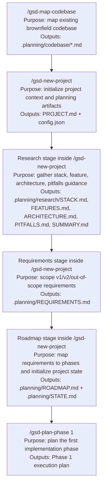

# GSD Workflow Map

This document records the GSD commands used for this project initialization flow, their order, purpose, and outputs.

## Command Summary

| Order | Command | Purpose | Primary Outputs |
|---|---|---|---|
| 1 | `/gsd-map-codebase` | Analyze the existing brownfield codebase before project initialization | `.planning/codebase/STACK.md`, `.planning/codebase/INTEGRATIONS.md`, `.planning/codebase/ARCHITECTURE.md`, `.planning/codebase/STRUCTURE.md`, `.planning/codebase/CONVENTIONS.md`, `.planning/codebase/TESTING.md`, `.planning/codebase/CONCERNS.md` |
| 2 | `/gsd-new-project` | Initialize project context, config, research, requirements, roadmap, and state | `.planning/PROJECT.md`, `.planning/config.json`, `.planning/research/*`, `.planning/REQUIREMENTS.md`, `.planning/ROADMAP.md`, `.planning/STATE.md` |
| 3 | `/gsd-plan-phase 1` | Next step after initialization: turn Phase 1 into an executable implementation plan | Phase 1 planning artifacts for execution |

## Mermaid Flow

## Current Status

- `/gsd-map-codebase` completed
- `/gsd-new-project` completed, with `PROJECT.md`, `config.json`, research docs, `REQUIREMENTS.md`, `ROADMAP.md`, and `STATE.md` created and committed in stages
- Next planned GSD command is `/gsd-plan-phase 1`
